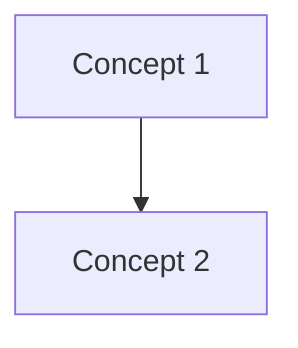

# Note templates

Copy-paste starting points for each note type. Replace `<…>` placeholders and fill in the PDF-specific content. Never leave a placeholder in a published note.

---

## Template: MOC (Map of Content)

```markdown
---
title: <Book Title> — MOC
tags:
  - <book-tag>
  - MOC
aliases:
  - <Book Title> Index
source: "<Book Title> — <Author>"
---

# <Book Title> — Map of Content

Reading notes distilled from *<Book Title>* by <Author>. Each concept is a standalone atomic note linked from the chapter pages and cross-linked where ideas touch.

> [!info] Progress
> **Extracted:** Chapters <A>–<B> (pages <X>–<Y> of the PDF).
> Chapters <C>–<end> remain to be extracted in future passes.

## Chapter index

| # | Chapter | Theme |
|---|---------|-------|
| 1 | [[Ch01 - <title>]] | <1-line theme> |
| 2 | [[Ch02 - <title>]] | <1-line theme> |

## Concepts by theme

### <Theme A>
- [[Concept 1]]
- [[Concept 2]]

### <Theme B>
- [[Concept 3]]

## Concept graph



## How these notes are organised

- `Chapters/` — one note per chapter, acting as a chapter-level index.
- `Concepts/` — atomic notes; one idea per file, linked generously.
- `attachments/` — figures and tables extracted from the PDF, referenced as `![[fig-1-4.jpg]]`.

## Source

- Original PDF: `<Book Title>` by <Author>.
- Notes are a **paraphrased summary for personal study**, not a reproduction.
```

---

## Template: Chapter index note

```markdown
---
title: "Chapter <N> — <Chapter Title>"
tags:
  - <book-tag>
  - chapter
aliases:
  - <Book Short Name> Chapter <N>
source: "<Book Title> — <Author>"
pdf_pages: "<start>-<end>"
---

# Chapter <N> — <Chapter Title>

> [!abstract] Chapter goal
> <One-sentence paraphrase of the chapter's stated goal.>

## <Overview section, e.g. "Evolution path (TL;DR)">


## Concepts in this chapter

| # | Concept | Problem it solves |
|---|---------|-------------------|
| 1 | [[Concept 1]] | <why it exists> |
| 2 | [[Concept 2]] | <why it exists> |

## Milestone figures

### <Milestone 1>
![[fig-<N>-1.jpg]]

### <Milestone 2>
![[fig-<N>-2.jpg]]

## Summary

- <Bullet point captured from the chapter's conclusion>
- <Another bullet>

## Related

- Previous: [[Ch<N-1> - <prev title>]]
- Next: [[Ch<N+1> - <next title>]]
- Parent: [[<Book Title> MOC]]
```

---

## Template: Concept note

```markdown
---
title: <Concept Name>
tags:
  - <book-tag>
  - concept
  - <sub-category>
aliases:
  - <synonym 1>
  - <synonym 2>
---

# <Concept Name>

<One- or two-sentence paraphrased definition. The book's own words, summarised.>

![[fig-<N>-<M>.jpg]]

## What it solves

<1–2 paragraphs in your own words.>

## How it works

<Numbered steps, table, or sub-sections. If the book has a diagram, embed it here.>

## Considerations / tradeoffs

> [!warning] Things to get right
> - **<Knob 1>** — <tradeoff>
> - **<Knob 2>** — <tradeoff>

## Related

- [[Related Concept 1]] — <one-line hook>
- [[Related Concept 2]] — <one-line hook>
- [[Ch<N> - <chapter title>]]
```

---

## Naming conventions

- Chapter notes: `Ch<NN> - <Title in Title Case>.md` (e.g. `Ch01 - Scale from Zero to Millions of Users.md`).
- Concept notes: `<Concept Name>.md` in Title Case, no dashes, words separated by spaces — this makes wikilinks read naturally as English.
- Figures: `fig-<chapter>-<number>.jpg` matching the book's own numbering.
- Tables: `table-<chapter>-<number>.jpg`.
- Code screenshots: `code-<descriptive-name>.jpg`.

Consistency matters far more than elegance — any divergence becomes a broken wikilink.
